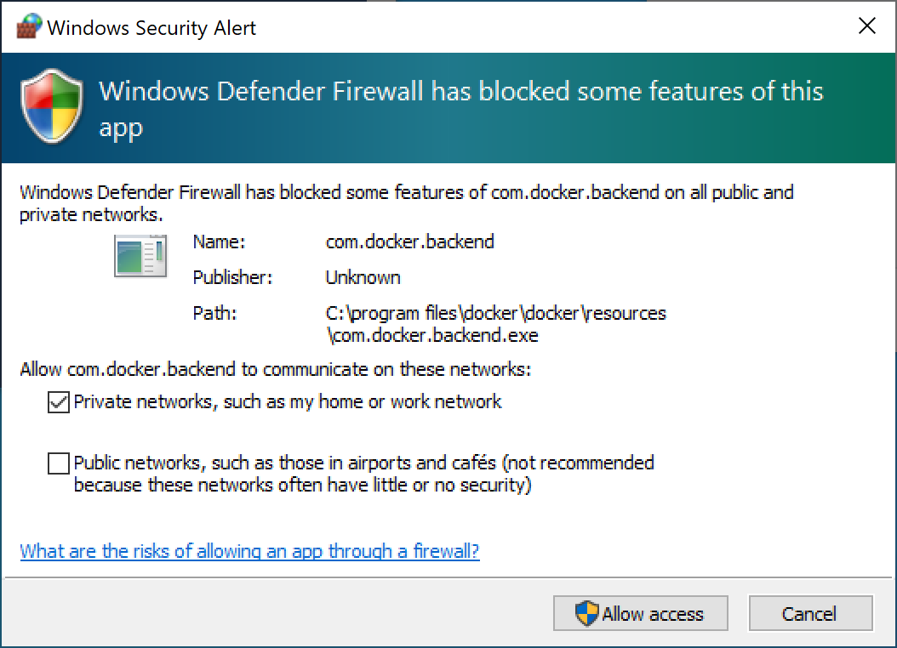

# Troubleshooting

Should you have any issues installing the required software the information below may help.

### Windows

**Git**

1. Install [Git](https://git-scm.com/download/win)
2. Open Git Bash or PowerShell to confirm successful install `git --version`

**Docker Desktop**

1. [Docker Desktop](https://www.docker.com/get-started) (requires restart)
2. Docker will now prompt you to install [wsl2-kernel](https://docs.microsoft.com/en-gb/windows/wsl/wsl2-kernel)

**Note:**

Windows users may get the following Security Alert. Tick the first option and allow access.

### Mac

**Git**

1. Open Terminal, enter `xcode-select --install` or install [homebrew](https://brew.sh/) or xcode and follow onscreen instructions
2. Confirm successful install `git --version`

**Docker Desktop**

1. [Docker Desktop](https://www.docker.com/get-started)
